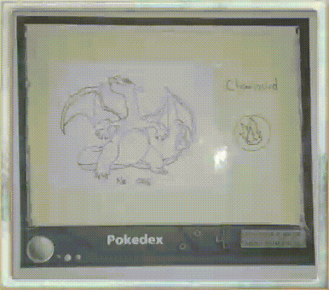
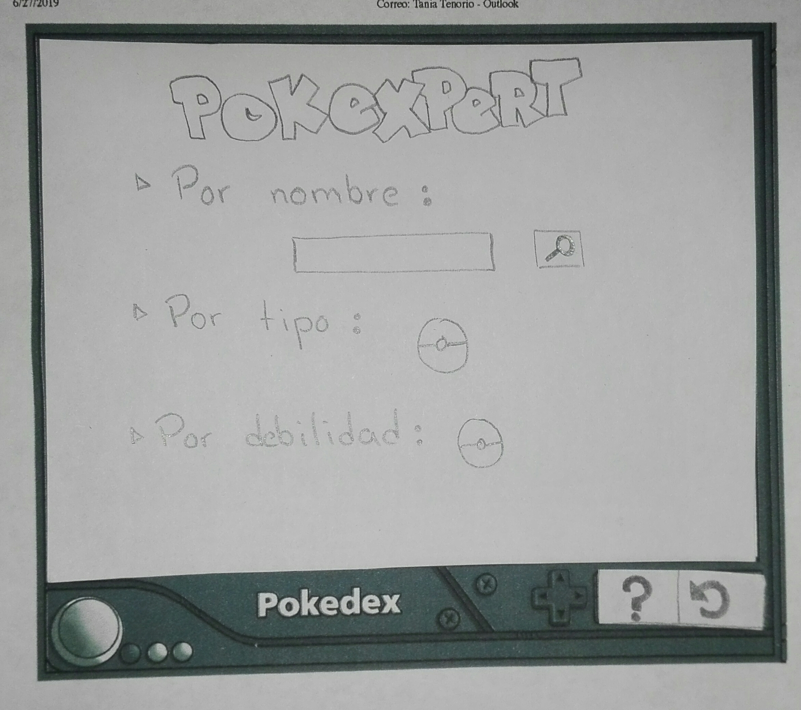
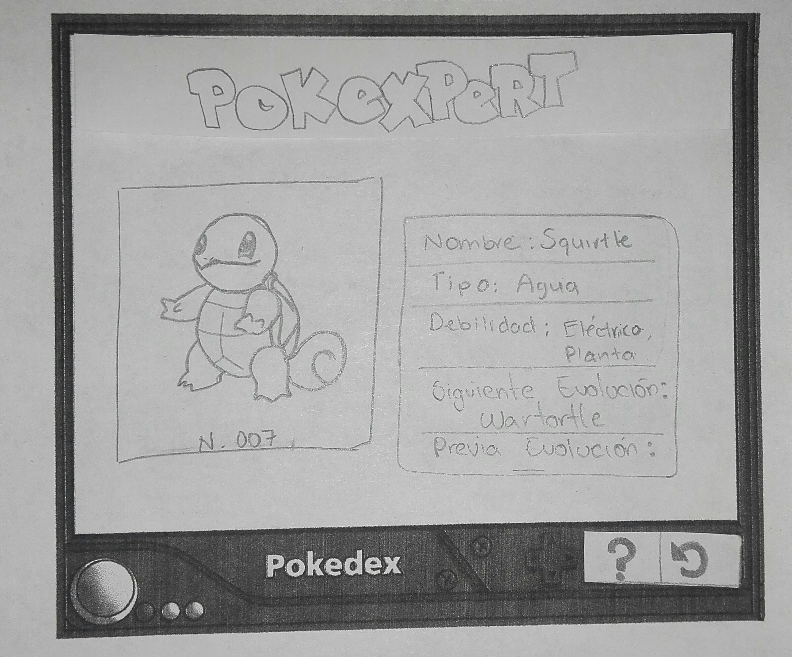
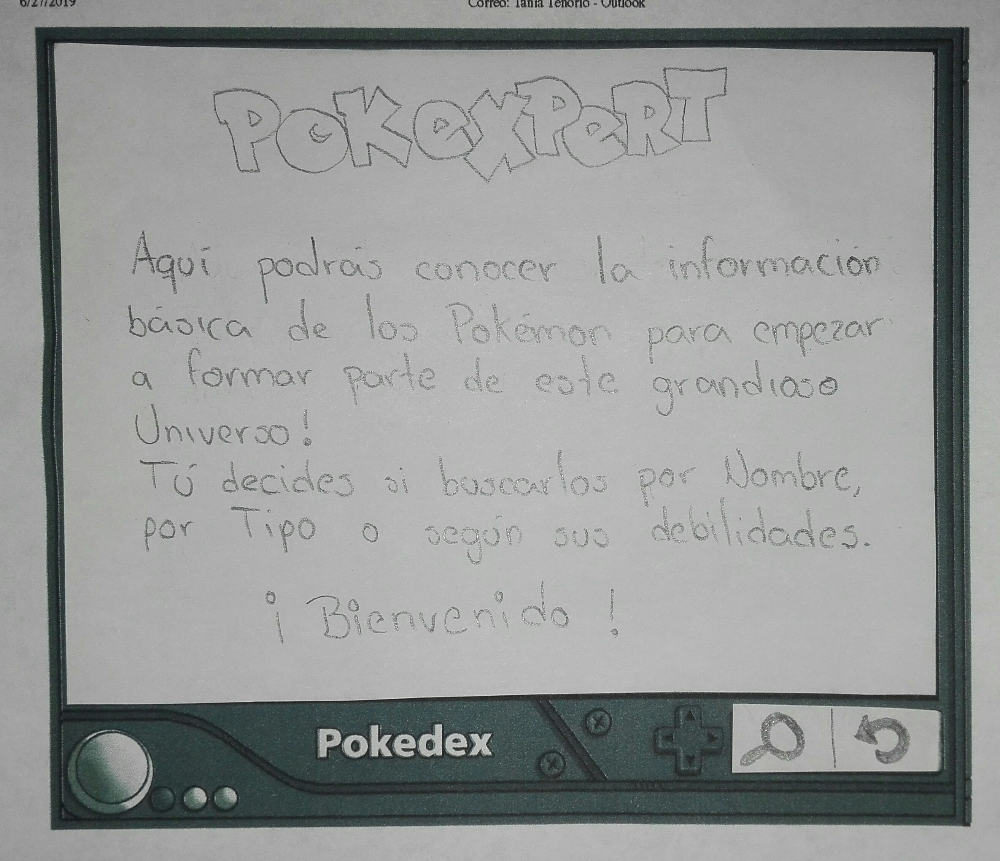
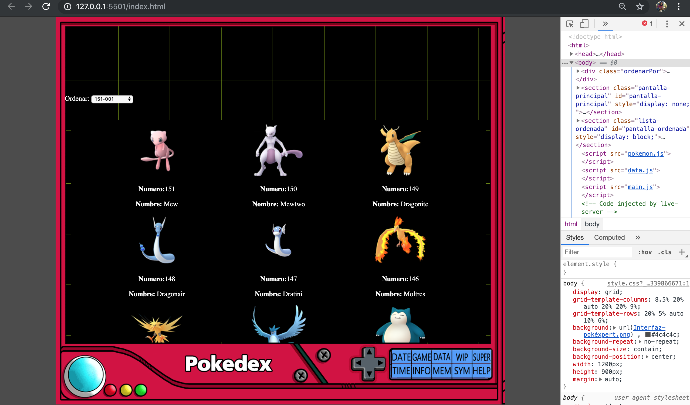

# Pokéxpert

## Planeación del diseño

### Research

En la etapa de descubrimiento e investigación se realizó una pequeña [encuesta](https://docs.google.com/forms/d/1tJGnAgtlCqnqvrWzWuQZs6nvSESzQ6HWGSOJAOwO7CY/edit#responses) con la herramienta **Google Forms**, donde se plantearon preguntas básicas para definir al usuario, conocer sus necesidades y, posteriormente,definir de qué manera podríamos solucionar esas necesidades con nuestro producto.

Las preguntas incluidas en la encuesta fueron:

1. ¿Cuál es tu edad?
2. ¿Cuál es tu género?
3. ¿Sabes qué es un Pokémon?
4. ¿Qué páginas o aplicaciones utilizas para consultar información sobre un Pókemon?
5. ¿Qué tan probable es que quieras saber más de ellos a través de un app?
6. ¿Qué características de ellos serían mas importantes para ti?

#### Conclusiones

Los datos que obtuvimos fueron de 52 encuestas contestadas, de las cuales obtuvimos los siguientes datos:

La mayor cantidad de personas que respondieron la encuesta tienen mas de 26 años.

-El 50% de los encuestados son mujeres, el 48% son hombres y el resto no se identifican con ninguno de estos dos géneros.

-La mayoría de los encuestados saben lo que es un Pokémon.

-Aquellos encuestados que contestaron saber lo suficiente para considerarse maestros Pókemon utilizan alguna página web o herramienta para consultar información sobre los Pokémon.

-Únicamente el 29% de los encuestados no están interesados en saber más sobre el tema a través de una app.

-Las características más importantes para la mayoría de los usuarios son:

1. Tipo (87%).
2. Siguiente Evolución (79%).
3. Nombre (76%).
4. Debilidades (76%).
5. Foto (74%).

## Definición del Usuario

Con los datos obtenidos de las encuestas, pudimos definir nuestro arquetipo de usuario contestando las siguientes preguntas:

-¿Quién es el usuario?

-¿Qué necesita el usuario?

-¿Cómo podemos satisfacer esa necesidad?

**Usuario:** Luis Vázquez es un hombre de 30 años,  con interés en el tema de Pokémon.

**Necesidad:** Tener acceso a la información básica y escencial de los Pókemon sin tener que acceder a un buscador en la web.

**Solución:** Luis podrá consultar las características básicas de los Pokémon desde una plataforma exclusiva para eso.

### Storytelling

Luis es un joven que hace poco conoció el juego PokémonGo, porque vio que la  mayoría de sus amigos lo jugaban y quiso saber qué es lo que tanto disfrutan de este juego. Luis se decidió a descarga el juego en su celular y de inmediato pudo capturar a su primer Pokémon, un Bulbasaur, y ahora empezaba a entender la emoción del juego, no podía esperar más para capturar al siguiente.

 Un día durante una reunión escuchó a sus amigos presumir todos los Pokémon que ya poseían, pero el no tenía ni idea de lo que era un Vulpix o un Snorlax y seguía escuchando nombres que ni siquiera podía pronunciar; se fue de esa reunión decidido a saber lo más que pudiera sobre los Pokémon. Le preguntó a sus amigos dónde podía buscar información y casi todos le  responden que puede buscar en google, en reddit, en calcy y otras páginas que el ni siquiera conoce, pero lo intenta; no dura mucho su búsqueda, después de tantos clicks, ventanas abiertas y mucha publicidad, se pregunta si no existe una app o una página sencilla donde sólo pueda consultar la información escencial para empezar a sumergirse en el mundo Pokémon.

  Finalmente, uno de sus amigos le enseña la app que él usa, se llama "Pokéxpert", Luis se decide a utilizarla y empieza a conocer a todos los Pokémon del universo aunque aún no se siente un maestro Pokémon. Después de estar horas inmerso investigando en el Pokéxpert ya tiene su Pokémon favorito, sabe sus debilidades y fortalezas y está más que decidido a capturar a cada Pokémon que se le cruce en el camino. Un par de semanas despúes Luis se vuelve a reunir con sus amigos para salir a capturar nuevos Pokémon, uno de ellos grita de emoción porque acaba de encontrar un Serperior y Luis no sabe qué es eso, pero no se preocupa porque, abre su Pokéxpert de inmediato e introduce el nombre que acaba de escuchar y en cuestión de segundos puede ver la foto y la información de este Pokémon.
  
   Ahora, Luis ya está listo para enfrentarse a ese nuevo Pokémon que acaba de conocer!

   ###Historias de Usuario

1. Entrar a la aplicación y poder explorar la información desde el principio.
    * DOD: que la pantalla muestre las imágenes de todos los pokemon.
2. Saber cómo funciona la aplicación.
    * DOD: tener un botón que despliegue una pantalla con información sobre la aplicación y su funcionamiento.
3. Tener diferentes opciones de búsqueda.
    * DOD: tener un botón de buscar (lupita) que despliegue una pantalla donde se muestren las diferentes opciones de búsqueda.
4. Poder buscar a un Pokémon en específico por su nombre.
    * DOD: tener un espacio para teclear el nombre el Pókemon y al dar click en el botón buscar, que se muestre la información de ese Pokémon.
5. Poder filtar los Pokémon según su tipo.
    * DOD: tener un botón para ver todos los tipos de Pokémon y poder seleccionar un tipo en particular para que muestre todos los Pokémon que pertenecen a ese tipo.
6. Poder filtrar los Pokémon según su debilidad.
    * DOD: tener un botón para ver todos los tipos de Pokémon y poder seleccionar uno de ellos para que muestre todos los Pokémon que son débiles ante ese tipo.

## Ideación

Durante el proceso de ideación utilizamos diferentes herramientas para obtener información e inspiración para poder diseñar nuestro prototipo de baja fidelidad.

-Benchmarking:

    1. Calcy IV
    2. Reddit
    3. www.pokemon.com.es

-Brainstorming:

    -Imagenes de fondo 
    -Iconos para botones
    -Interaccion en la intefaz
    -Cuántas secciones
    -Métodos de filtrado
    -Cómo mostrar las características
    -etc...

## Prototipado

El primer prototipo diseñado para este proyecto considera las caracteristicas establecidas anteriormente buscando tener una interaccion dinamica y sencilla.

### Sketch

Nuestro prototipo de baja fidelidad se realizó en Marvel para poder añadir interacciones y poder hacer el testing con usuarios.

[Marvel](https://marvelapp.com/54bga3j)

Posteriormente se realizó el prototipo de alta fidelidad, tomando en cuenta los comentarios obtenidos durante el testing del prototipo de baja fidelidad.

[Figma](https://www.figma.com/proto/RuuRyCwdiktPEFaCtM0xpCVN/Pok%C3%A9xpert?node-id=27%3A0&scaling=min-zoom)

## User testing

Se hizo el testing del prototipo de baja fidelidad con 5 usuarios, de los cuales obtuvimos varios comentarios en común. Entre ellos, que el flujo de la información no estaba clara y que en algunas pantallas, el boton de ayuda no era necesario.

Se realizó un segundo testing con el prototipo de alta fidelidad con 5 usuarios. Los usuarios consideraron que el flujo de la información y la transición de las secciones era sencillo e intuitivo. Solamente un usuario nos comentó que no combinaramos textos en inglés y español.

## Desarrollo del Producto Final

Con el feedback recabado durante en user testing, empezamos a desarrollar el producto para poder completar cada una de las historias de usuario.

